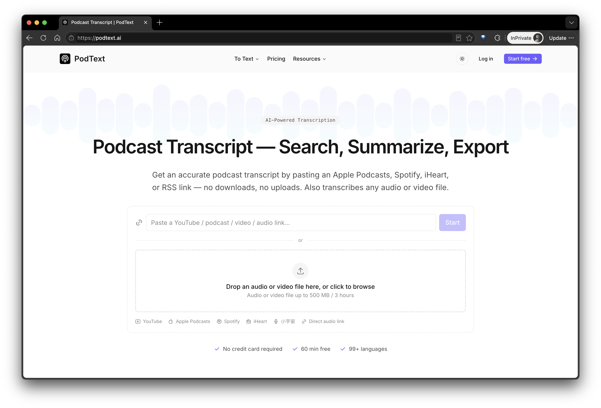

  

<h1 align="center">PodText.ai</h1>

<b>팟캐스트·오디오·비디오를 텍스트로 —— AI 기반 전사, 요약, 내보내기</b>

  
  

  <a href="./README.md">🇺🇸 English</a> ・ <a href="./README.zh-CN.md">🇨🇳 简体中文</a> ・ <a href="./README.ja.md">🇯🇵 日本語</a> ・ 🇰🇷 한국어 ・ <a href="./README.de.md">🇩🇪 Deutsch</a>

---

## PodText.ai란?

**[PodText](https://podtext.ai)**는 모든 **팟캐스트, 오디오, 비디오를 깔끔하고 검색 가능하며 내보내기 가능한 텍스트로 변환**해 주는 AI 기반 도구입니다. 다운로드나 업로드 과정 없이 몇 초 만에 완료됩니다.

**Apple Podcasts, Spotify, 샤오위저우(小宇宙), YouTube** 또는 공개 RSS/오디오 URL 링크를 붙여넣기만 하면, PodText가 에피소드를 가져와 최신 음성 인식 AI로 전사를 수행합니다. 완성된 텍스트는 **검색, 요약, 내보내기**가 가능하며 SRT/VTT 자막, 일반 텍스트, 또는 Markdown 형식의 쇼노트로 출력할 수 있습니다.

인터뷰, 회의, 강의 등 직접 오디오·비디오 파일을 업로드할 수도 있습니다.

**[무료로 시작하기 →](https://podtext.ai)** 신용카드 불필요, 무료 60분 제공.

## 📸 제품 스크린샷

  

## ✨ 주요 기능

- 🔗 **링크만 붙여넣으면 전사 완료** —— Apple Podcasts, Spotify, 샤오위저우, YouTube, RSS/직접 오디오 링크 지원. 직접 다운로드하거나 업로드할 필요가 없습니다.
- 📁 **오디오·비디오 파일 업로드 지원** —— 인터뷰, 회의, 강의 등 긴 콘텐츠도 처리 가능.
- 🌍 **99개 이상 언어 지원** —— 자동 언어 감지, 중국어·일본어·한국어·독일어 등도 정확하게 인식.
- 🔍 **전문 검색** —— 전사본 내에서 원하는 부분으로 바로 이동.
- 🧠 **AI 기반 인사이트** —— 요약, 챕터 구분, 핵심 포인트 및 인용구 자동 생성.
- 📤 **다양한 형식으로 내보내기** —— SRT·VTT 자막, 일반 텍스트, Markdown 지원으로 발행·편집·재활용에 최적.
- ⚡ **빠르고 정확** —— 최신 음성 인식 모델 기반.
- 💳 **무료로 시작** —— 무료 60분 제공, 신용카드 불필요.

## 🎯 이런 분들께 추천합니다

- **팟캐스터** —— 에피소드를 블로그 글, 쇼노트, SEO에 강한 전사본으로 전환.
- **콘텐츠 크리에이터** —— YouTube 및 숏폼 영상용 자막 생성.
- **저널리스트·연구자** —— 인터뷰와 녹음을 전사해 인용 및 분석에 활용.
- **교육자·학생** —— 강의를 검색 가능한 학습 노트로 변환.
- **팀** —— 회의 녹음을 공유·검색 가능한 텍스트로 변환.

## ⚙️ 이용 방법

1. **링크를 붙여넣거나 파일을 업로드** —— 팟캐스트 에피소드, 비디오, 오디오 녹음.
2. **AI가 자동으로 전사** —— 정확하고 다국어를 지원하며 깔끔한 형식으로 정리.
3. **검색, 요약, 내보내기** —— SRT/VTT 자막, 일반 텍스트, 또는 Markdown 쇼노트로 출력.

## 💰 요금제

| 플랜 | 가격 | 월간 크레딧 | 추천 대상 |
|---|---|---|---|
| 무료 | $0 | 무료 60분 | 체험용 |
| Starter | $19.99/월 | 500 | 정기적으로 활동하는 팟캐스터 |
| Pro | $39.99/월 | 1,500 | 크리에이터 및 소규모 팀 |
| Advanced | $99.99/월 | 5,000 | 에이전시 및 헤비 유저 |
| 종량제 | $5부터 | 100~250 크레딧 | 가끔 사용하는 경우 |

연간 할인 등 자세한 내용은 **[podtext.ai/pricing](https://podtext.ai/pricing)**에서 확인하세요.

## ❓ 자주 묻는 질문

**PodText는 무료로 사용할 수 있나요?**
네. 모든 신규 계정은 신용카드 없이 60분의 무료 전사 크레딧을 받습니다.

**PodText는 어떤 플랫폼을 지원하나요?**
Apple Podcasts, Spotify, 샤오위저우, YouTube, 그리고 공개 RSS 피드나 오디오·비디오 직접 링크를 지원합니다. 자체 파일 업로드도 가능합니다.

**YouTube 영상도 전사할 수 있나요?**
네. YouTube 링크를 붙여넣으면 PodText가 전체 전사본과 SRT/VTT 자막을 생성합니다.

**몇 개 언어를 지원하나요?**
자동 감지 기능으로 99개 이상의 언어를 지원하며, 영어·중국어·일본어·한국어·독일어 등이 포함됩니다.

**어떤 형식으로 내보낼 수 있나요?**
SRT, VTT, 일반 텍스트(TXT), Markdown을 지원합니다.

**전사뿐만 아니라 요약도 생성되나요?**
네. PodText의 AI 인사이트 기능은 전체 전사본과 함께 요약, 챕터, 핵심 포인트/인용구도 함께 생성합니다.

## 🔗 링크

- 웹사이트: [podtext.ai](https://podtext.ai)
- Twitter/X: [@ruguodev](https://x.com/ruguodev)
- Bluesky: [@ruguodev.bsky.social](https://bsky.app/profile/ruguodev.bsky.social)

---

다시 듣기보다 읽고 싶은 모든 팟캐스터, 크리에이터, 팀을 위해.

